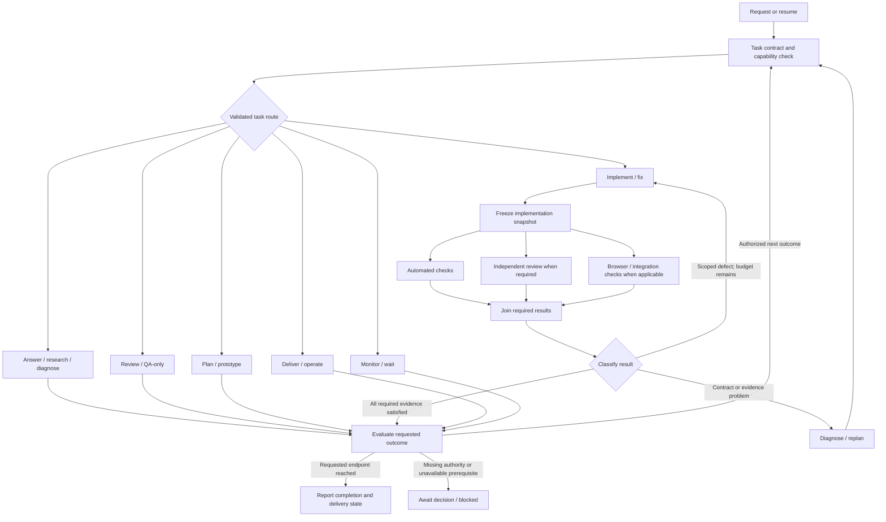
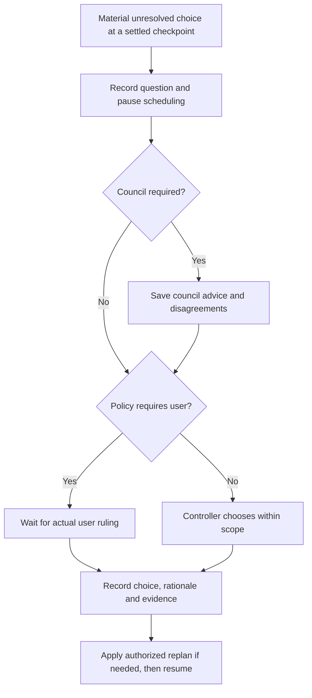

# Adaptive workflow graph proposal

Date: 2026-09-20  
Status: Architecture proposal with an initial host-mediated implementation under `do`; advanced adapters and Jev remain deferred.  
Scope: A reusable workflow for Claude, Codex, and configured external harnesses. Jev is an optional later addition.

## Goal and recommended decisions

Provide one entry point that selects an appropriate path for the user's current task, carries its authority and evidence across handoffs, and stops at the requested outcome. A question should be answerable directly. An investigation should be able to end with a diagnosis. A substantial implementation should get independent review, relevant verification, and only the delivery actions already authorized.

Build a small, local workflow runner in this repository. Expose it through a new `do` skill while retaining existing direct skill invocations. Keep `complete`, `offload`, their configuration and active runs unchanged so the established workflow remains available. No migration of `complete` is planned. The current implementation and explicit limits are documented in [the do runner reference](../skills/core/do/references/runner.md).

Initial decisions:

- Use a bounded intake agent to propose a structured task contract and route. Deterministic policy validates permissions, dependencies, required checks, and allowed transitions.
- Separate task intent, risk, uncertainty, and authority. Neither a risk label nor a model's confidence grants permission.
- Compose reusable subgraphs, with controlled feedback loops for corrections and replanning. This is a state machine with parallel branches, not a strictly acyclic graph.
- Default to one writer and selective parallel read-only work. Add concurrent builders only for genuinely independent slices.
- Keep Jev out of the initial critical path. Define a replaceable decision-provider interface and evaluate Jev later in advisory mode.
- Treat the architecture below as a target; consult the do runner reference for implemented interfaces and deferred features. No efficiency improvement has been measured.

## Current foundations

Inspected repository revision: `cc8c475`; the canonical Claude and Codex manifests both report version `3.8.2`.

| Existing component | Reuse | Change needed |
| --- | --- | --- |
| [complete](../skills/core/complete/SKILL.md) and its [native route](../skills/core/complete/codex-orchestration.md) | Runtime selection, owned work, frozen acceptance, independent review, final integration | Generalize beyond coding and merge-readiness; move transition enforcement into code |
| [offload](../skills/core/offload/SKILL.md) | External builder dispatch, visible workers, ownership, results and supervision | Keep runtime-specific mechanics inside the external adapter |
| [harness.mjs](../skills/core/offload/harness.mjs) | Configured harness selection and availability handling | Expose resolved capabilities and actual model identity to the runner |
| [ledger.mjs](../skills/core/offload/ledger.mjs) | Single-owner state and reconciliation concepts | Use a durable run identity independent of a Claude session; add attempt and evidence identities |
| [review](../skills/gstack/review/SKILL.md), [investigate](../skills/gstack/investigate/SKILL.md), [prototype](../skills/core/prototype/SKILL.md), QA and planning skills | Task-specific methods and acceptance requirements | Load only relevant skills; preserve their mandatory rules |
| [existing evals](../evals/README.md) | Behavioral evaluation separate from structural checks | Add routing, recovery, authorization, and outcome fixtures |

Historical sessions motivate bounded review loops and better liveness tracking. They include older plugin versions, so they do not establish that every historical failure remains in the current implementation. No speed, cost, or quality improvement is established by this proposal.

## Task routing

Intake records the user's request verbatim and extracts an ordered set of requested outcomes. It can compose routes: “investigate and fix” becomes diagnosis followed by change; “review this” ends after the review report. Explicit user constraints and applicable repository instructions take precedence over inferred intent.

| Task family | Normal path | Completion evidence | Default effect boundary |
| --- | --- | --- | --- |
| Answer / explain / research | Scope → gather needed evidence → synthesize | Supported answer, sources where needed, uncertainty | Read-only; persist a report only when requested or clearly part of the deliverable |
| Diagnose | Reproduce → test hypotheses → establish cause → report | Reproduction or causal evidence, limits, proposed correction | No source fix unless authorized |
| Review / assess / QA-only | Pin scope → inspect or exercise → findings → report | Snapshot, coverage, reproducible findings, verdict | No fixes, PR comments, or delivery implied |
| Plan / design | Discover constraints → alternatives when needed → proposal → relevant plan checks | Actionable artifact, decisions, acceptance criteria | Requested proposal artifacts only; no implementation |
| Prototype / explore | Frame learning question → disposable experiment → evaluate → capture learning | Demonstrated experiment and conclusion | Isolated scratch assets; no automatic production promotion or cleanup |
| Implement / fix / refactor | Scope → plan as needed → build → freeze → verify/review → reconcile | Requested behavior, required gates, independent review when required | Scoped source changes; delivery separately authorized |
| Deliver / operate | Inspect current state → preflight → perform authorized action → verify outcome | Actual remote/service state and delivery record | Only explicitly scoped operations; dry run stays read-only |
| Monitor / wait | Observe → evaluate condition → wait → observe | Condition reached, user stop, or genuine inability to observe | No corrective mutation unless already authorized |

Writing and document requests use plan/design when the deliverable is a proposal, or implement/create when the deliverable is the finished artifact. Verification follows the artifact: rendering and factual checks for a document, executable checks for code. There is no universal “all tasks must become a PR” endpoint.

### How branching becomes intelligent

The intake agent proposes `intent`, ordered outcomes, affected surfaces, uncertainty, scope, and an evidence-linked rationale. It uses a small repository inventory rather than reading the whole project. The runner validates the proposal against a finite route registry and the recorded authority.

1. Apply explicit constraints first: diagnosis-only, report-only, protected paths, frozen contracts, no commit, dry run, named harness, and existing permissions.
2. Identify the requested endpoint and use the shortest eligible task path.
3. Attach surface checks: frontend → rendered behavior; database → migrations/data invariants; auth/trust boundaries → applicable security review; consumed API/CLI → compatibility checks. Preserve any additional requirements of loaded skills.
4. Use uncertainty to decide whether discovery is necessary. A small diff can still be high risk; changed-line count is not the sole classifier.
5. If ambiguity would change permissions or the deliverable, ask one focused question. Otherwise proceed with a stated, reversible assumption inside existing scope.
6. Reassess at explicit boundaries: discovery complete, plan frozen, implementation ready, verification failure, and user steering. Record changed route and rationale; do not silently grow scope.

Untrusted repository text and tool output are evidence, never new instructions or permissions. A model may recommend a route; it cannot invent executable commands or arbitrary graph edges outside the registered node contracts.

Suggested risk profiles are `light`, `standard`, and `sensitive`. They select optional depth, never waive mandatory criteria. Sensitive work includes authorization, payments, destructive data operations, production changes, and other project-defined boundaries. An informational question about such code can remain read-only while requiring stronger source evidence.

## Graph structure



Every node can report a blocker, cancellation, or failed prerequisite; the overview omits those repeated edges. A monitor stays within its observation loop until its condition or stop rule is met. Missing observations are unknown, not success. When the host has no recurring execution facility, report that limitation instead of promising unattended monitoring.

### Decisions and involvement

The initial runner now records `decisionPolicy` and durable questions/rulings. Default to `checkpointed`: ask on consequential unresolved approach/delivery choices. `collaborative` asks on all consequential choices; `autonomous` delegates within-scope choices. All modes require a user ruling for scope expansion, frozen-acceptance changes, missing authority and user-dependent blockers. Explicit instructions already settling a choice do not need another approval.

Council is advisory and conditional. Under the default `auto` policy, a consequential uncertain tradeoff uses the existing council skill, usually in quick mode with simulated perspectives. Missing facts call for investigation; missing permission calls for the user. Parallel council seats require an explicit user request. Jev remains deferred.



The host identifies and classifies choices; the runner enforces the resulting pause and ruling requirements. It cannot discover omitted decisions or authenticate a claimed user message. A council result cannot grant effects, lower frozen gates or impersonate the user. Recorded rulings do not themselves change the contract. The first implementation pauses all new work while a question is open; selective branch pauses are not implemented.

### Conditional checks and parallel work

The planner freezes a required-check set before dispatch. Skipped checks have a recorded applicability reason; missing required checks are not skips. Test environment setup is a dependency: checks cannot run against an environment that is still being provisioned. Concurrent checks use isolated ports, databases, accounts, and fixtures when they could interfere.

Start with one builder. Once its snapshot is stable, automated checks, independent review, and applicable browser QA may run concurrently. Reviewers receive the same pinned scope and distinct specialties where multiple reviewers are useful. Join their results into one correction packet before resuming edits. A correction invalidates affected evidence; final integration is checked again.

In the initial runner, every later writing outcome also reruns earlier implementation gates against the new snapshot before reporting success. Historical diagnosis and earlier builders remain historical; their execution is not repeated. Integration failures route to the latest writing outcome for correction.

Concurrent builders require separate verified worktrees, explicit file ownership, stable shared interfaces, and an integration owner. Shared contract changes precede dependent implementation. Worktrees do not isolate databases or remote services. The scheduler reserves those resources separately and respects the runtime's available slots.

## Roles, skills, and runtime adapters

| Role | May do | Must return |
| --- | --- | --- |
| Intake / planner | Inspect, scope, propose route and criteria | Task contract, route rationale, open decisions |
| Investigator | Read and perform scoped diagnostic experiments | Observations, hypotheses, disconfirming checks, supported cause |
| Builder / creator | Edit assigned files and run authorized checks | Change inventory, snapshot, raw results, remaining questions |
| Reviewer | Read pinned scope and investigate findings | Confirmed findings, coverage, exact reviewed snapshot; no source edits |
| Check runner | Run registered checks in designated environments | Command, environment, exit status, raw artifact, snapshot |
| Integrator / delivery worker | Combine accepted work or execute authorized delivery | Final integration and external-state evidence |
| Controller | Validate transitions, own state, schedule eligible nodes | Durable events, status, evidence accounting, escalation |

Roles are bounded assignments. They need not all be persistent agents, and check runners should usually be ordinary processes. The parent can answer a simple question directly. Specialist skills supply methods; role briefs supply scope and authority. Do not load every skill at intake.

The initial runner can be a Node CLI invoked by the host agent. It returns proposed actions for the host to execute and accepts structured results. A native adapter uses tools actually exposed by that host. An external adapter uses a supported launcher. A standalone Node process cannot assume access to in-session collaboration tools.

Each adapter declares launch, status, message, cancel, artifact collection, supported model selection, and enforcement capabilities. Resolve models from explicit user choices, then an applicable role configuration, otherwise inherit the active model where supported. Record requested and actual values. An unavailable required harness/model produces a visible decision; it never triggers an unapproved fallback.

Delegation uses the existing [handoff skill](../skills/core/handoff/SKILL.md)'s eight-section document and the existing builder conventions for scope, disagreements, frozen gates and raw results. The controller saves each packet with `brief` before launch and records the worker identity afterward. Existing applicable harness preferences are read through `harness.mjs`; no second preference configuration is introduced. The guarded `offload` mailbox and launcher remain a separate runtime-specific workflow, not a second controller for a `do` attempt. Automatic launch adapters remain deferred.

Permission enforcement needs both policy checks and runtime restrictions. A role prompt alone is not a sandbox. Where a harness cannot enforce a required restriction, use an isolated compatible environment or report the limitation before sensitive work. Do not claim read-only enforcement merely because it was requested in text.

## Durable state and evidence

Use a configurable private per-user state directory, outside tracked project files, with one directory per durable run ID. Show the run path in status and handoffs. Session IDs, worker IDs, panes, PIDs, and worktrees are adapter-specific references inside that run, never interchangeable identities.

The minimum contract is:

| Record | Required fields |
| --- | --- |
| Run | Schema version, run ID, repository identity, original request, current endpoint, task contract version, authority and its source, route/rationale, policy version, budgets, controller lease |
| Node attempt | Run/node/attempt IDs, role, dependencies, inputs, owned paths/resources, adapter, resolved model, worker reference, launch intent, state, timestamps |
| Evidence | ID, attempt, artifact location and hash, base/head or local snapshot fingerprint, command/environment where applicable, result, coverage, contract version |
| Decision | Boundary, proposed choices, selected transition, actor/provider, evidence references, reason, uncertainty, authority check |

Node states: `pending`, `ready`, `launching`, `running`, `results-ready`, `accepted`, `blocked`, `failed`, `cancelled`, `superseded`. Only accepted dependencies release required successors. A failed attempt remains recorded when a new attempt starts; it is not overwritten as successful.

Separate execution, verification, and delivery status. A review can be successfully completed with a DO NOT LAND verdict. A code change can be locally verified but not ready for delivery because required CI is missing. Report these facts independently rather than compressing them into `done`.

Record state changes in an append-only event log with a recoverable snapshot. Use a single-writer lock/lease, revision checks, and fencing against stale controllers. Workers write result artifacts; only the controller changes run state. Reject unknown schema versions and preserve corrupt state for recovery.

Before launching, persist an attempt ID and launch intent. Use that ID for idempotency and reconciliation. A crash after launch but before recording a worker ID must trigger a search for that attempt, not immediate relaunch. If the adapter cannot establish whether a worker is alive, block the conflicting work until ownership is resolved. Do not promise exactly-once execution across external systems.

Snapshot evidence includes relevant dirty/untracked content and generated inputs, not just HEAD. Reuse is valid only when the checked inputs, contract, tool configuration, and relevant environment still match. Dynamic external-state evidence may need refresh even without a code change. Unknown impact requires rerunning the check.

Cancellation stops scheduling, requests supported worker cancellation, reconciles actual state, and preserves results. Do not report a worker stopped merely because a cancel request was sent. Cleanup is a separate authorized operation with dirty-worktree and ownership checks.

## Failure and correction policy

| Outcome | Response |
| --- | --- |
| Confirmed implementation defect | One consolidated correction assignment within current scope, followed by affected checks/review |
| Missing or stale evidence | Gather or rerun the specific evidence; do not reflexively rebuild |
| Invalid gate or conflicting requirement | Replan with a versioned ruling; retain the original failure and criteria; do not relax a gate to manufacture green |
| Environment or harness failure | Bounded recovery using authorized alternatives; separate from implementation retries |
| New scope or authority needed | Report decision and pause the affected branch; independent authorized work may continue |
| Duplicate/advisory finding | Preserve and classify it; defer optional work without suppressing mandatory requirements |

Proposed default: after two unsuccessful corrective attempts on the same acceptance item, enter diagnosis/replanning rather than issuing a third blind rebuild. Replanning does not reset the overall run budget. Set per-run limits for corrective work, replanning, tool timeouts, and optional elapsed/cost budgets; budget exhaustion yields an explicit blocked/incomplete result, never acceptance. Provider usage may be unavailable, so do not fabricate cost totals.

Normal monitoring waits do not consume defect-correction budgets. Long-running actions use the product's notification/wait facilities and communicate material progress without busy polling.

## Jev as a later extension

The initial decision provider is the host reasoning agent plus deterministic policy. Reserve a provider-neutral assessment interface: versioned rubric, scoped evidence bundle, narrow questions, typed answers, uncertainty, provider/model identity, latency, and usage when available. Provider answers remain proposals to policy; they never directly invoke tools or authorize effects.

Jev is a candidate for evidence support, missing-context detection, and finding categorization after review. TypeSafe documents typed decisions and parallel independent questions while recommending that code retain control flow and side effects. Its confidence measures do not guarantee an individual answer's correctness. [Architecture](https://docs.typesafe.ai/concepts/how-to-build-with-system-one), [System One](https://docs.typesafe.ai/concepts/system-one), [confidence](https://docs.typesafe.ai/confidence).

Follow the existing [Jev security-review proposal](jev-security-review-proposal.md): first replay completed cases with known outcomes, then advisory live use, and only later consider narrowly bounded routing influence. Include `insufficient_evidence`, contradictory evidence, incomplete fixes, and hostile instructions embedded in source material. Preserve deterministic checks and independent review.

Jev is disabled by default and makes no network calls in the initial release. Later enablement requires repository-data authorization, credential handling, data minimization, deadlines, and provider-failure behavior. If an optional provider fails, continue the original workflow and report its missing assessment. Thresholds must be evaluated on held-out cases; they are not guessed constants in this proposal.

## Implementation sequence

Implementation layout:

```text
skills/core/do/SKILL.md            entry point and selective reference routing
skills/core/do/references/         routing, contracts and host execution protocol
scripts/do/                       CLI, state engine, policy, snapshots and tests
evals/do/                         realistic behavioral evaluation cases
```

1. **Contracts and simulator.** Define run/attempt/evidence schemas, a finite task registry, authority rules, and transition tests using fake workers. Deliver `start`, `status`, `resume`, and `cancel` semantics without launching real harnesses. Exit when route selection and crash recovery are reproducible.
2. **One live vertical slice.** Choose one explicitly configured harness and wire launch/status/results into the runner. Support a report-only review and a scoped implementation through verification. Exit when an interrupted run resumes without duplicate workers or stale acceptance.
3. **Task composition and conditional checks.** Add answer, diagnose, plan, prototype, operations, and monitoring paths; support ordered outcomes and user steering. Attach surface-specific checks. Exit when permission-sensitive routing fixtures pass on both supported host families.
4. **Selective concurrency.** Add snapshot-based verification fan-out, resource reservations, cancellation, and one consolidated join. Add a second builder only after independent-worktree and integration fixtures pass.
5. **Compatibility rollout.** Introduce `do` as a separate workflow; retain direct specialist invocations, `complete`, and legacy runs unchanged. Do not convert active legacy ledgers or change `complete` routing. Update canonical manifests and release versions together when shipping the new skill.
6. **Decision-provider experiment.** Add Jev in advisory mode, evaluate outcomes and overhead, then make a separate decision about allowing specific routing influence.

Keep the first implementation local and inspectable. A heavyweight graph framework, distributed service, and production dashboard are deferred. The visual companion to this proposal is a review artifact, not the runner UI.

## Validation and rollout gates

| Fixture | Required behavior |
| --- | --- |
| “Why is this failing?” | Diagnose and report; do not edit source |
| “Find and fix the failure; do not commit” | Diagnose, scoped correction, verification; no commit/push |
| “Review this PR” | Report-only review; no fixes, comments, or merge |
| “Build a proposal” | Produce the proposal; no workflow implementation |
| “Fix this UI behavior” | Add applicable rendered interaction evidence |
| One-line auth change | Preserve security obligations despite small diff |
| Unknown intent with consequential ambiguity | Ask a focused question before effects |
| Missing required reviewer or test environment | Report missing evidence; never accept as clean |
| Builder changes files during review | Invalidate affected review evidence and re-pin |
| Two failures on the same item | Diagnose/replan within an overall bound |
| Crash between launch and worker-ID recording | Reconcile attempt; never blindly duplicate |
| Two controllers resume the same run | Exactly one state writer; stale owner fenced |
| Conflicting builders or shared test database | Serialize or isolate before dispatch |
| User revokes write permission mid-run | Stop new conflicting work, request cancellation, reconcile effects |
| Dry-run cleanup / unknown worker liveness | Remain read-only / do not duplicate or delete |
| Monitor with unchanged external state | Continue legitimate waiting until its stop condition |
| Host/model unavailable | Report capability gap; no invented IDs or silent fallback |
| Jev disabled, unavailable, or adversarial input | No initial dependency; later optional failure cannot grant authority |

Use `ruby scripts/validate-skills.rb` for structural changes and relevant helper tests when helpers change. Add executable engine tests with fake adapters, live smoke tests per supported adapter, and behavioral routing evaluations. Text assertions about instructions do not prove runtime recovery or permission enforcement.

Compare representative tasks against the current workflow with matched scope, harness/model configuration, and environments. Record elapsed time, user interventions, corrective rounds, redundant checks, cost when known, missed defects, and false blockers. Report uncertainty and separate harness failures from routing mistakes. Promote only when authority/acceptance invariants hold and observed usefulness justifies the overhead.

## Decisions for the implementation kickoff

| Choice | Recommendation and tradeoff |
| --- | --- |
| Entry point | Add `do` as a separate discoverable skill. Preserve established `complete` semantics and implementation. |
| First adapter | Pick the harness used for the next real pilot task. External processes can outlive a host session; native agents offer direct supervision but may be unreachable after session changes. Validate both through the same contract eventually. |
| State storage | Private per-user directory with reported absolute run path. Better session durability than temporary files; requires retention and cleanup policy. |
| Small-task overhead | Allow an ephemeral direct-answer path with no worker or durable ledger when no recovery is needed. Persist runs that launch workers, mutate files, or have multiple dependent stages. |
| Initial concurrency | One builder plus independent verification. Multi-builder work adds integration and resource coordination and follows later. |

These defaults avoid a new framework or changes to model preferences. The initial implementation is host-mediated: it returns assignments for the current agent to execute, supports one writer plus parallel read-only checks, and records their evidence. Automatic external adapters, resource reservation, multi-builder scheduling, and Jev remain later work. See the runner reference for exact boundaries.
